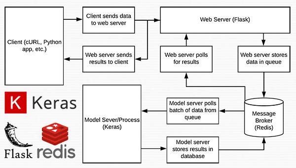

# Sample Work Queue

This sample was taken from a machine learning blog:
https://www.pyimagesearch.com/2018/02/05/deep-learning-production-keras-redis-flask-apache/

Feel free to read the blog and understand the intent of the provided code.



The tutorial talks about apache web server but you can just run the commands in three separate shells (or threads in colab):

First shell:
```
python run_web_server.py 
```

Second shell:
```
python run_model_server.py
```

Third shell:
```
python simple_request.py 
```

# Setup settings.py

You will need to put your own redis connection information in [settings.py](settings.py). You can get a free 30mb REDIS account on redis.io. Or alternatively you could install REDIS locally.

# Python environment
- Recommend using Python 3.11.3 https://www.python.org/ftp/python/3.11.3/
- I like to use VSCode. You can launch vscode from this directory. Then use the command pallete to (ctrl+shift+p) "Python: Create Virtual Environment". Then choose the 3.11.3 version and check the box for including requirements.txt (or pip install it after).
- pip install -r requirements.txt

# Deliverables (PDF that includes code)

1. What is the "key" in the REDIS database where the web server stores the user's image. What type is the value? Describe the structure of it.

2. How does the web server communicate with the model (worker) server to hand off work and receive back results? Describe how it works for the web server to respond to web requests.

3. What is the result of sending "[castle_image.jpg](castle_image.jpg)" through simple request?
What objects with which scores does it identify this as?


4. Does the current system have any issues if you were to have multiple font end servers (run_web_server.py) and multiple workes (run_model_server.py)? What issues are there? Update the code to fix one of these issues, test that it works, and explain with words and diagrams what you did to solve it.

5. Polling is the most expensive way to interact with a system. Polling can be reliable, but costly. Rather than having the web server poll REDIS waiting for a key to show up, could you research, think, and implement a way that instead uses notifications and only uses polling as a backup. Test your implementation and describe how you fixed it with words, code, and diagrams.

6. The [stress_test.py](stress_test.py) code doesn't work. Could you fix it?

7. Tracing what happens in a multi-agent system can be challenging. Can you write a simple logging function that can be called from any of the files that logs in a consistent format (server name, main running python script, timestamp, action)